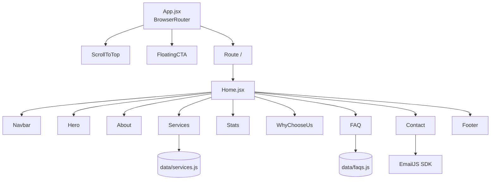

# Design Document

## Uthan Senior Home Care Website

---

## Overview

This document describes the technical design for the Uthan Senior Home Care website — a production-grade React 18 + Vite single-page application (SPA) that replaces the existing GoDaddy Website Builder site at uthanseniorcare.com.

The site is a marketing and lead-generation SPA for a Social Adult Day Care center in Deer Park, Suffolk County, New York. Its primary goals are:

1. Convey warmth, trust, and professionalism to prospective families researching senior care options.
2. Present the center's six care programs clearly.
3. Drive contact inquiries via an EmailJS-powered form.
4. Rank well in local search results for adult day care in Suffolk County.

The application is a single route (`/`) that renders all content sections in a vertical scroll layout. There are no server-side data fetches; all content is static or driven by local data modules. The only external runtime dependency is EmailJS for form submission.

---

## Architecture

### High-Level Structure

```
Browser
  └── React SPA (BrowserRouter)
        ├── ScrollToTop (route utility)
        ├── FloatingCTA (global mobile CTA)
        └── Route "/"
              └── Home
                    ├── Navbar
                    ├── Hero
                    ├── About
                    ├── Services
                    ├── Stats
                    ├── WhyChooseUs
                    ├── FAQ
                    ├── Contact
                    └── Footer
```

### Data Flow

```
src/data/services.js  ──→  Services component
src/data/faqs.js      ──→  FAQ component
EmailJS SDK           ←──  Contact component (form submit)
```

All state is local to individual components. There is no global state manager (Redux, Zustand, etc.) — the application is simple enough that component-level `useState` and `useEffect` are sufficient.

### Deployment Architecture

```
npm run build
    └── dist/
          ├── index.html
          ├── assets/ (JS, CSS, images)
          └── (copied from public/)
                └── .htaccess  ← SPA routing for GoDaddy cPanel
```

The `.htaccess` file rewrites all non-asset requests to `index.html`, enabling React Router's `BrowserRouter` to handle client-side routing on Apache-based GoDaddy cPanel hosting.

### Mermaid Component Diagram



---

## Components and Interfaces

### App.jsx

Responsibilities: BrowserRouter shell, global component mounting, route definition.

```jsx
// Props: none
// Renders: BrowserRouter > ScrollToTop, FloatingCTA, Routes > Route path="/" element={<Home />}
```

### pages/Home.jsx

Responsibilities: Renders all section components in the required order.

```jsx
// Props: none
// Renders: Navbar, Hero, About, Services, Stats, WhyChooseUs, FAQ, Contact, Footer
// Each section is wrapped in a <main> element for semantic structure
```

### components/Navbar.jsx

Responsibilities: Fixed navigation, scroll-aware background transition, mobile hamburger menu.

```jsx
// Props: none
// Internal state:
//   scrolled: boolean  — true when window.scrollY >= 80
//   menuOpen: boolean  — true when mobile hamburger is active
// Behavior:
//   - useEffect adds/removes scroll event listener
//   - Links use react-scroll <Link> with smooth:true, offset:-80
//   - Mobile menu animated with Framer Motion (AnimatePresence + motion.div)
```

### components/Hero.jsx

Responsibilities: Full-viewport hero with background image, animated content, dual CTAs.

```jsx
// Props: none
// Background: Unsplash photo-1529156069898-49953e39b3ac via direct URL
// Overlay: absolute inset-0 bg-black/50
// Animations: Framer Motion variants with staggerChildren on container
// CTAs: react-scroll Links to #services and #contact
```

### components/About.jsx

Responsibilities: Two-column mission/background section with scroll-triggered animations.

```jsx
// Props: none
// Background: bg-warm
// Layout: grid grid-cols-1 md:grid-cols-2
// Image: Unsplash photo-1576765608535-5f04d1e3f289
// Animations: useInView + Framer Motion variants
```

### components/Services.jsx

Responsibilities: Three-column service card grid with staggered entrance animations.

```jsx
// Props: none
// Data: imports services array from src/data/services.js
// Layout: grid grid-cols-1 md:grid-cols-2 lg:grid-cols-3
// Animations: staggerChildren on container, each card animates independently
```

### components/Stats.jsx

Responsibilities: Gold background statistics section with count-up animation.

```jsx
// Props: none
// Background: bg-gold
// Layout: grid grid-cols-2 md:grid-cols-4
// Count-up: useEffect + setInterval triggered by useInView
// Stats data: defined inline as a local array
```

### components/WhyChooseUs.jsx

Responsibilities: Navy background trust-building section with 2×2 card grid.

```jsx
// Props: none
// Background: bg-navy text-white
// Layout: grid grid-cols-1 md:grid-cols-2
// Trust cards: defined inline as a local array
// Pull quote: blockquote element with decorative styling
```

### components/FAQ.jsx

Responsibilities: Accordion FAQ with AnimatePresence transitions.

```jsx
// Props: none
// Data: imports faqs array from src/data/faqs.js
// Background: bg-warm
// State: activeIndex: number | null — index of currently open item
// Behavior: clicking an item sets activeIndex; clicking again sets to null
//           opening a new item automatically closes the previous one
// Animation: AnimatePresence wraps each answer panel
```

### components/Contact.jsx

Responsibilities: Two-column contact section with info panel and EmailJS form.

```jsx
// Props: none
// Layout: grid grid-cols-1 md:grid-cols-2
// Left panel: bg-navy, displays address, phone, email, hours
// Form state: { name, email, phone, message }
// Validation state: { errors: object, status: 'idle'|'sending'|'success'|'error' }
// EmailJS: @emailjs/browser sendForm() called on valid submit
```

### components/Footer.jsx

Responsibilities: Four-column footer with navigation links, social icons, copyright.

```jsx
// Props: none
// Background: bg-navy (dark variant)
// Layout: grid grid-cols-1 md:grid-cols-2 lg:grid-cols-4
// Links: react-scroll Links for in-page navigation
// Copyright: displays new Date().getFullYear() dynamically
```

### components/FloatingCTA.jsx

Responsibilities: Mobile-only fixed phone CTA with pulse animation.

```jsx
// Props: none
// Visibility: block md:hidden (Tailwind responsive)
// Position: fixed bottom-6 right-6
// Animation: animate-pulse (Tailwind) or Framer Motion pulse variant
// Action: <a href="tel:5165100267">
```

### components/ScrollToTop.jsx

Responsibilities: Resets scroll position on route change.

```jsx
// Props: none
// Uses: useLocation from react-router-dom
// Effect: useEffect(() => window.scrollTo(0, 0), [pathname])
// Renders: null
```

---

## Data Models

### Service Object (`src/data/services.js`)

```js
{
  id: string,          // unique identifier e.g. "recreational-activities"
  icon: ReactElement,  // React Icons component reference
  title: string,       // display name e.g. "Recreational Activities"
  description: string  // 1–2 sentence description of the service
}
```

The array contains exactly six entries:
1. Recreational Activities
2. Family Counseling
3. Nutritious Meals
4. Transportation
5. Community Engagement
6. Yoga & Meditation

### FAQ Object (`src/data/faqs.js`)

```js
{
  id: string,      // unique identifier e.g. "faq-eligibility"
  question: string, // the FAQ question text
  answer: string    // the FAQ answer text
}
```

The array contains exactly six entries covering: eligibility, hours, transportation, meals, activities, and enrollment.

### Contact Form State

```js
{
  name: string,
  email: string,
  phone: string,
  message: string
}
```

### Form Validation Errors State

```js
{
  name?: string,    // error message if name is empty
  email?: string,   // error message if email is empty or invalid format
  phone?: string,   // error message if phone is empty
  message?: string  // error message if message is empty
}
```

### Form Submission Status

```
'idle'     — initial state, no submission attempted
'sending'  — EmailJS request in flight
'success'  — EmailJS resolved successfully
'error'    — EmailJS rejected or threw
```

### Tailwind Brand Color Tokens

```js
// tailwind.config.js extend.colors
{
  gold:  '#C8972B',
  navy:  '#1A2B4A',
  warm:  '#F9F6F0',
  cream: '#FBF8F3'
}
```

### Tailwind Font Family Tokens

```js
// tailwind.config.js extend.fontFamily
{
  serif: ['Playfair Display', 'Georgia', 'serif'],
  sans:  ['DM Sans', 'system-ui', 'sans-serif']
}
```

---

## Correctness Properties

*A property is a characteristic or behavior that should hold true across all valid executions of a system — essentially, a formal statement about what the system should do. Properties serve as the bridge between human-readable specifications and machine-verifiable correctness guarantees.*

### Property 1: Services data completeness

*For any* service object in the services array, the object SHALL have a non-empty `icon`, `title`, and `description` field, and the array SHALL contain exactly six items.

**Validates: Requirements 7.1, 7.4**

### Property 2: Service card renders all required elements

*For any* service object in the services array, when its card is rendered, the output SHALL contain a gold top border element, the service icon, the service title, and the service description.

**Validates: Requirements 7.4**

### Property 3: FAQ data completeness

*For any* FAQ object in the faqs array, the object SHALL have a non-empty `question` and `answer` field, and the array SHALL contain exactly six items.

**Validates: Requirements 10.1**

### Property 4: FAQ accordion mutual exclusion

*For any* two distinct FAQ items i and j, if item j is opened while item i is already open, then item i SHALL be closed and only item j SHALL be open.

**Validates: Requirements 10.4, 10.7**

### Property 5: Contact form rejects empty required fields

*For any* combination of required fields (name, email, phone, message) that are left empty, submitting the contact form SHALL display a validation error for each empty field and SHALL NOT invoke the EmailJS send function.

**Validates: Requirements 11.4**

### Property 6: Contact form rejects invalid email formats

*For any* string that does not conform to a valid email address format (user@domain.tld), submitting the contact form with that string in the email field SHALL display an email validation error and SHALL NOT invoke the EmailJS send function.

**Validates: Requirements 11.5**

### Property 7: ScrollToTop fires on every route change

*For any* route navigation event, the ScrollToTop component SHALL call `window.scrollTo(0, 0)` exactly once.

**Validates: Requirements 14.2**

### Property 8: All rendered images have non-empty alt attributes

*For any* `` element rendered anywhere in the application, the element SHALL have a non-empty `alt` attribute.

**Validates: Requirements 15.2**

### Property 9: Footer copyright year is current

*For any* year in which the Footer component is rendered, the copyright notice SHALL contain that year as a string.

**Validates: Requirements 12.5**

---

## Error Handling

### Contact Form — EmailJS Failure

When `emailjs.sendForm()` rejects, the form sets `status = 'error'` and renders an inline error banner:

> "Something went wrong. Please call us at (516) 510-0267 or email uthancare@uthanseniorcare.com directly."

The form fields remain populated so the visitor does not lose their input.

### Contact Form — Client-Side Validation

Validation runs on submit (not on blur) to avoid premature error messages. Each required field is checked for non-empty trimmed value. The email field is additionally checked against a standard email regex. Errors are displayed as small red text beneath each field.

### Image Loading Failures

Unsplash images are referenced by direct URL. If an image fails to load, the `alt` text is displayed and the section remains functional. Background image sections have a fallback background color (navy or warm) defined in Tailwind so the section is never blank.

### Route Not Found

The application defines only the `/` route. Any other path will render a blank page. A catch-all `<Route path="*">` can be added in a future iteration to render a 404 page, but is out of scope for this version.

### Build Failures

If `npm run build` fails, the `dist/` directory will not be produced. The developer should check the Vite build output for TypeScript/ESLint errors. The `.htaccess` file is in `public/` and is automatically copied to `dist/` by Vite's build process.

---

## Testing Strategy

### PBT Applicability Assessment

This feature is primarily a React UI application with static content, animations, and a single form submission. The majority of acceptance criteria are UI structure checks, style checks, and specific content checks — not universal properties over a wide input space.

However, several areas are suitable for property-based testing:
- Data module completeness (services.js, faqs.js)
- Form validation logic (email format, empty field detection)
- Accordion mutual exclusion logic
- ScrollToTop behavior
- Image alt attribute presence

PBT library: **fast-check** (JavaScript/TypeScript, works with Vitest).

### Unit Tests (Vitest + React Testing Library)

Focus on specific examples, component structure, and interaction behavior:

- `Navbar.test.jsx` — renders logo, links, CTA button; scroll state transitions; hamburger open/close
- `Hero.test.jsx` — renders heading, subheadline, both CTA buttons, scroll indicator
- `About.test.jsx` — renders two-column layout classes, image, badge pills
- `Services.test.jsx` — renders 6 cards; each card has border, icon, title, description
- `Stats.test.jsx` — renders 4 stat items with correct labels
- `WhyChooseUs.test.jsx` — renders 4 trust cards, pull quote
- `FAQ.test.jsx` — accordion open/close; only one item open at a time; gold border on open item
- `Contact.test.jsx` — form fields present; validation errors on empty submit; EmailJS mock success/error
- `Footer.test.jsx` — 4 columns, social icons, copyright year
- `FloatingCTA.test.jsx` — phone link, pulse class, mobile-only visibility class
- `ScrollToTop.test.jsx` — window.scrollTo called on route change

### Property-Based Tests (Vitest + fast-check)

Each property test runs a minimum of 100 iterations.

**Property 1 & 3 — Data module completeness**
```
// Feature: uthan-senior-home-care-website, Property 1: Services data completeness
// Feature: uthan-senior-home-care-website, Property 3: FAQ data completeness
fc.assert(fc.property(fc.integer({ min: 0, max: 5 }), (i) => {
  const item = services[i];
  return item.icon != null && item.title.length > 0 && item.description.length > 0;
}));
```

**Property 2 — Service card renders all required elements**
```
// Feature: uthan-senior-home-care-website, Property 2: Service card renders all required elements
fc.assert(fc.property(fc.constantFrom(...services), (service) => {
  const { getByText } = render(<ServiceCard service={service} />);
  return getByText(service.title) && getByText(service.description);
}));
```

**Property 4 — FAQ accordion mutual exclusion**
```
// Feature: uthan-senior-home-care-website, Property 4: FAQ accordion mutual exclusion
fc.assert(fc.property(
  fc.integer({ min: 0, max: 5 }),
  fc.integer({ min: 0, max: 5 }).filter(j => j !== i),
  (i, j) => {
    // open i, then open j, verify only j is open
  }
));
```

**Property 5 — Form rejects empty required fields**
```
// Feature: uthan-senior-home-care-website, Property 5: Contact form rejects empty required fields
fc.assert(fc.property(
  fc.record({
    name: fc.oneof(fc.constant(''), fc.string()),
    email: fc.oneof(fc.constant(''), fc.string()),
    phone: fc.oneof(fc.constant(''), fc.string()),
    message: fc.oneof(fc.constant(''), fc.string()),
  }).filter(f => !f.name.trim() || !f.email.trim() || !f.phone.trim() || !f.message.trim()),
  (formData) => {
    // submit form, verify EmailJS not called, verify errors shown
  }
));
```

**Property 6 — Form rejects invalid email formats**
```
// Feature: uthan-senior-home-care-website, Property 6: Contact form rejects invalid email formats
fc.assert(fc.property(
  fc.string().filter(s => !/^[^\s@]+@[^\s@]+\.[^\s@]+$/.test(s)),
  (invalidEmail) => {
    // submit form with invalid email, verify email error shown, EmailJS not called
  }
));
```

**Property 7 — ScrollToTop fires on every route change**
```
// Feature: uthan-senior-home-care-website, Property 7: ScrollToTop fires on every route change
fc.assert(fc.property(fc.string(), fc.string(), (pathA, pathB) => {
  // navigate from pathA to pathB, verify window.scrollTo(0,0) called
}));
```

**Property 8 — All rendered images have non-empty alt attributes**
```
// Feature: uthan-senior-home-care-website, Property 8: All rendered images have non-empty alt attributes
// Render each component, query all img elements, verify alt is non-empty
```

**Property 9 — Footer copyright year is current**
```
// Feature: uthan-senior-home-care-website, Property 9: Footer copyright year is current
fc.assert(fc.property(fc.integer({ min: 2020, max: 2100 }), (year) => {
  jest.spyOn(Date.prototype, 'getFullYear').mockReturnValue(year);
  const { getByText } = render(<Footer />);
  return getByText(new RegExp(String(year)));
}));
```

### Integration Tests

- **EmailJS submission** — mock `@emailjs/browser`, submit a fully valid form, verify `sendForm` was called with correct service/template IDs and the success message is displayed.
- **EmailJS failure** — mock `@emailjs/browser` to reject, verify the error banner with phone/email fallback is displayed.

### Smoke / Manual Checks

- `npm run build` produces `dist/` without errors
- `public/.htaccess` is present in `dist/` after build
- `tailwind.config.js` contains all four brand color tokens and both font families
- `package.json` lists all required runtime dependencies
- Visual review at 375px, 768px, 1280px viewport widths
- Color contrast audit using browser DevTools or axe-core
- Keyboard navigation audit (Tab through all interactive elements)
